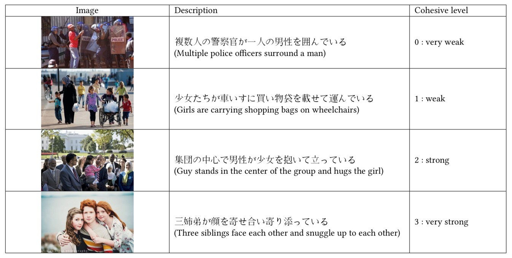

# Additional EmotiW dataset
Additional datasets for the group-based cohesion and emotion understanding tasks. It contains situation description text for static and dynamic visual data.
## Group-based Cohesion Prediction (EmotiW2019)
Linguistic contextual information contains lots of meaningful representation for analyzing group cohesion levels. We manually add japanese text to describe the image of GAF Cohesion dataset from human interaction viewpoint.　<br><br>
As shown in the following figure, There are some samples from GAF 3.0 validation dataset. The description is annotated in Japanese language and added to the training and validation dataset. A high score indicates strong cohesion among people shown in the image. 
<div align="center"></div>

We also provide english text which is converted from japanese text using Goolge translation API. Besides, we extract BERT work embedding features stored in the H5 file so that you can adapt your work easily. Due to the large size of the BERT feature, we send the download link to anyone who needs it.
* **train-bert-jp.h5/valid-bert-jp.h5:** word embedding is extracted using [the pre-trained BERT model provided by kyoto university](http://nlp.ist.i.kyoto-u.ac.jp/index.php?BERT%E6%97%A5%E6%9C%AC%E8%AA%9EPretrained%E3%83%A2%E3%83%87%E3%83%AB).
* **train-bert-en.h5/valid-bert-en.h5:** word embedding is extracted using [BERT pre-trained model provided by Google](https://github.com/google-research/bert).

### Citations
We only release the additional description text data, if you want to utilize our description text with GAF 3.0, you need to connect [EmotiW officer](https://sites.google.com/view/emotiw2019/organizers?authuser=0) to get GAF 3.0 dataset.  And don't forget to refer the following papers.

```BibTeX
@INPROCEEDINGS{gaf,
  author={S. {Ghosh} and A. {Dhall} and N. {Sebe} and T. {Gedeon}},
  booktitle={2019 International Joint Conference on Neural Networks (IJCNN)}, 
  title={Predicting Group Cohesiveness in Images}, 
  year={2019},
  volume={},
  number={},
  pages={1-8},}
```

```BibTeX
@inproceedings{ldnn,
author = {Wang, Yanan and Wu, Jianming and Huang, Jinfa and Hattori, Gen and Takishima, Yasuhiro and Wada, Shinya and Kimura, Rui and Chen, Jie and Kurihara, Satoshi},
title = {LDNN: Linguistic Knowledge Injectable Deep Neural Network for Group Cohesiveness Understanding},
year = {2020},
publisher = {Association for Computing Machinery},
address = {New York, NY, USA},
series = {ICMI ’20}
}
```
